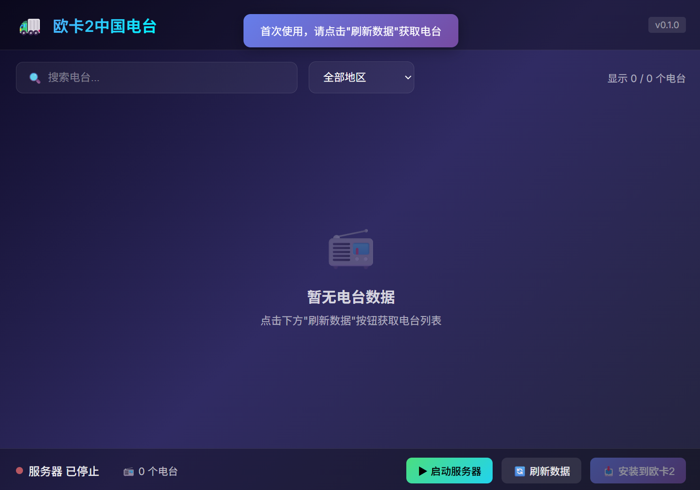
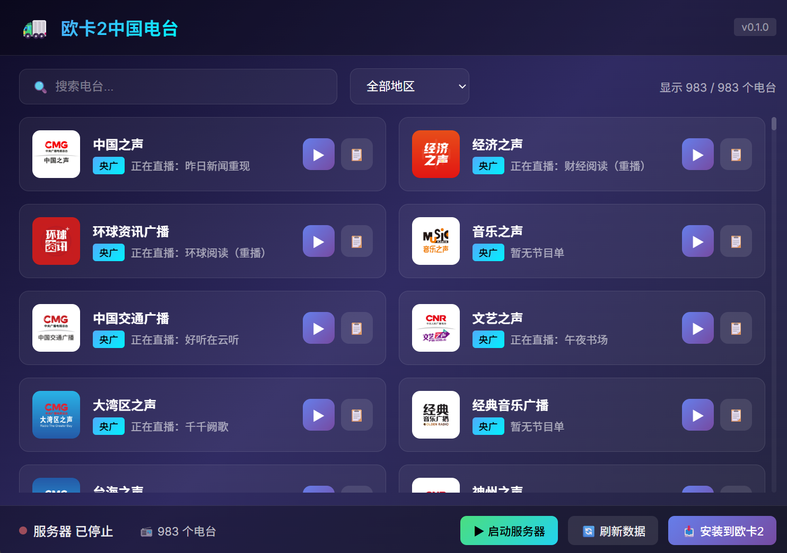
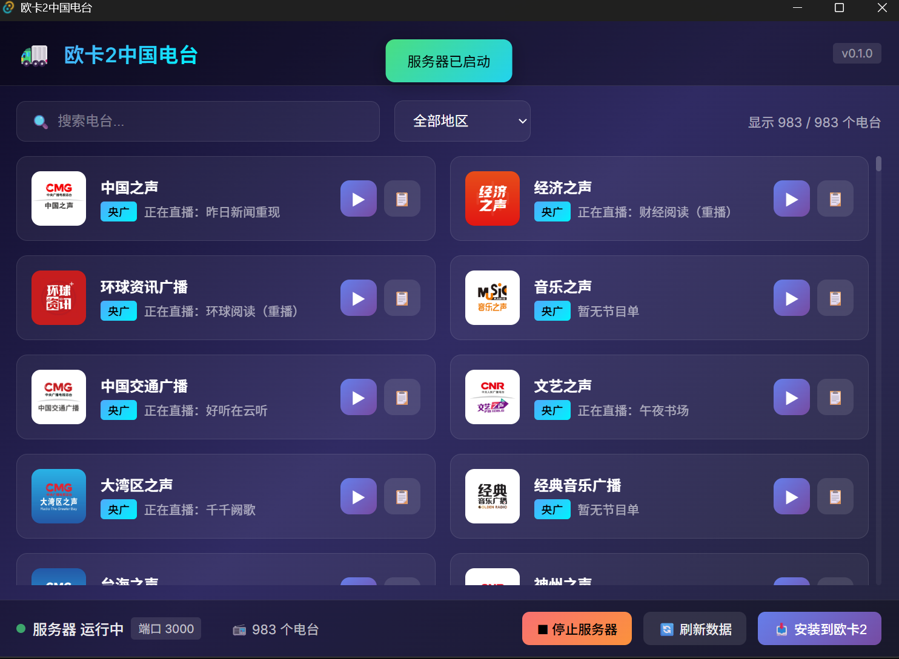
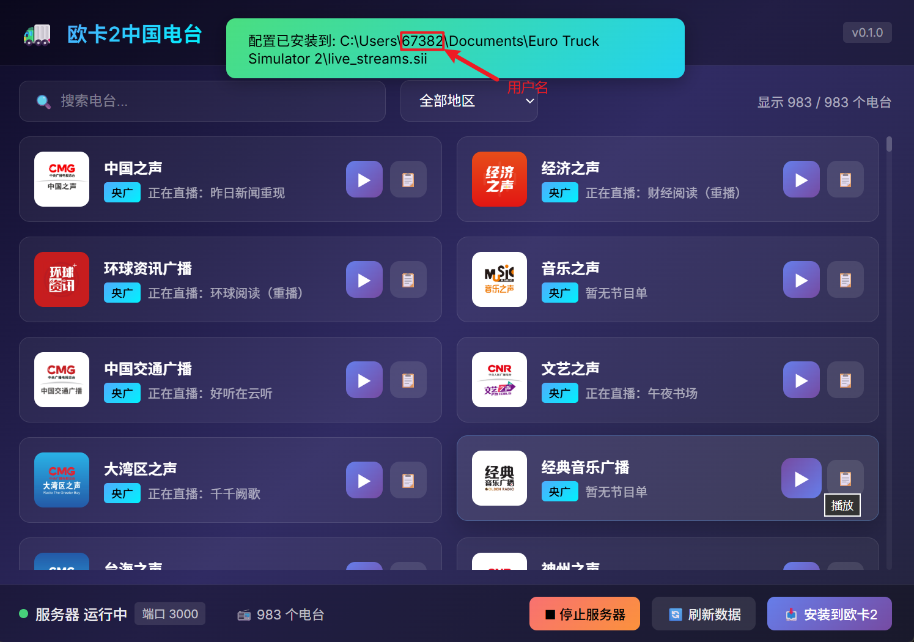
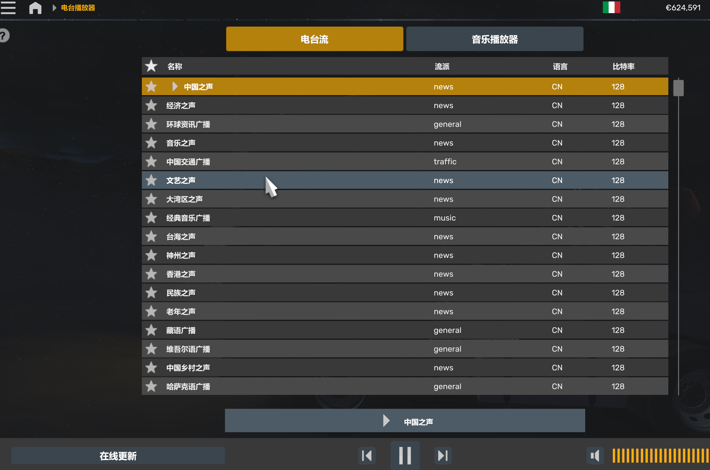

# 欧卡2中国电台 (ETS2 China Radio)

<!-- <p align="center">
  
</p> -->

<p align="center">
  <b>让欧洲卡车模拟器2也能听到中国电台！</b>
</p>

<p align="center">
  <a href="#下载安装">📥 下载</a> •
  <a href="#使用指南">📖 使用指南</a> •
  <a href="#常见问题">❓ FAQ</a> •
  <a href="#开发">🔧 开发</a>
</p>

---

## ✨ 功能特性

- 🎵 **900+ 中国电台** - 自动获取全国各省市广播电台
- 🔄 **实时流转换** - 将云听电台的 m3u8 格式转换为欧卡2可用的 MP3 格式
- 📻 **内置播放器** - 安装前可试听每个电台
- � **一键安装** - 自动生成欧卡2配置文件，无需手动操作
- 🔍 **搜索筛选** - 按地区、名称快速找到想听的电台

## 📥 下载安装

### 系统要求

- **Windows**: Windows 10 / 11 (64位)
- **macOS**: macOS 11.0+ (Apple Silicon / M 芯片)
- 欧洲卡车模拟器 2 (Euro Truck Simulator 2)

### 下载

前往 [Releases](https://github.com/hu19940121/ouka2-app/releases) 页面下载最新版本：

**Windows:**
- **推荐**: `ETS2-China-Radio_x.x.x_x64-setup.exe` - NSIS 安装包，带卸载程序

**macOS (Apple Silicon):**
- `ETS2-China-Radio_x.x.x_aarch64.dmg` - Apple Silicon (M1/M2/M3/M4) 安装包

> ⚠️ **macOS 用户注意**: 由于应用未经 Apple 签名，首次打开时需要:
> 1. 右键点击应用，选择「打开」
> 2. 在弹出的对话框中再次点击「打开」

### 安装步骤

1. 下载安装包后双击运行
2. 按照安装向导提示完成安装
3. 安装完成后，从开始菜单或桌面快捷方式启动应用

> ⚠️ **注意**: 安装包已内置 FFmpeg，无需额外安装任何依赖。

## 📖 使用指南

### 第一步：首次启动与获取电台数据

首次启动应用时，界面可能显示"暂无电台数据"。点击底部状态栏的 **「🔄 刷新数据」** 按钮获取最新的电台列表。



等待几秒钟后，应用会自动从云听获取全国 **900+ 个电台**，包括中央台和各省市地方台。



> 💡 **提示**：左上角可以按地区筛选电台，或使用搜索框快速查找。

---

### 第二步：启动流媒体服务器

点击底部状态栏的 **「▶ 启动服务器」** 按钮。启动成功后，状态会变为"运行中"，按钮也会变成"停止服务器"。



> ⚠️ **重要**：服务器运行在本地 `3000` 端口，这是让欧卡2能够收听电台的关键。**玩游戏时请保持本应用在后台运行！**

---

### 第三步：试听电台（可选）

在安装到游戏前，你可以点击任意电台卡片上的 **播放按钮** ▶ 试听，确认电台能正常播放。

---

### 第四步：安装到欧卡2

点击底部状态栏的 **「📥 安装到欧卡2」** 按钮。应用会自动在以下位置生成 `live_streams.sii` 配置文件：

**Windows:**
```
C:\Users\你的用户名\Documents\Euro Truck Simulator 2\live_streams.sii
```

**macOS:**
```
~/Library/Application Support/Euro Truck Simulator 2/live_streams.sii
```

---

### 第五步：进入游戏享受中国电台

启动欧洲卡车模拟器2，在卡车里打开收音机，切换频道就能看到中国电台列表了！



选择一个电台，就可以开始收听了！



---

### 使用流程图

```
启动应用 → 刷新数据 → 启动服务器 → 安装到欧卡2 → 进入游戏 → 享受中国电台 🎵
```

### ⚠️ 重要提示

| 提示 | 说明 |
|------|------|
| ⚡ **保持应用运行** | 玩游戏时请保持本应用在后台运行，否则电台将无法播放 |
| 🔄 **每次游戏前** | 确保已点击「启动服务器」，状态显示为"运行中" |
| 📡 **需要网络** | 电台需要联网才能收听 |
| 🔁 **重启游戏** | 首次安装后需要重启游戏才能看到电台列表 |

## ❓ 常见问题

### Q: 游戏里看不到电台？
A: 请确保：
1. 已点击「安装到欧卡2」按钮
2. 重新启动了欧卡2游戏
3. 在游戏中的收音机切换不同频道查找

### Q: 电台播放没有声音？
A: 请检查：
1. 应用中的「启动服务器」是否已启用（显示为绿色/运行中状态）
2. 在应用内试听是否正常
3. 确保网络连接正常

### Q: 能否最小化到托盘？
A: 目前应用需要保持窗口打开。你可以将窗口最小化到任务栏。

### Q: 如何更新电台列表？
A: 点击「刷新数据」按钮即可获取最新的电台列表。

### Q: 卸载后如何清理游戏配置？
A: 删除以下文件即可：
- **Windows**: `C:\Users\你的用户名\Documents\Euro Truck Simulator 2\live_streams.sii`
- **macOS**: `~/Library/Application Support/Euro Truck Simulator 2/live_streams.sii`

---

## 🔧 开发

以下内容面向开发者。

### 前置要求

- Node.js 18+
- Rust 1.70+
- FFmpeg (开发时需要系统安装)

### 安装依赖

```bash
npm install
```

### 运行开发版本

```bash
npm run tauri dev
```

### 打包发布

```bash
npm run tauri:build
```

此命令会：
1. 自动检测 FFmpeg 是否存在
2. 如果不存在，自动下载并解压 FFmpeg
3. 构建前端和 Rust 后端
4. 生成安装包

### 打包输出

打包完成后，安装文件位于：
- **MSI 安装包**: `src-tauri/target/release/bundle/msi/`
- **NSIS 安装包**: `src-tauri/target/release/bundle/nsis/`

### 技术栈

- **前端**: Vue 3 + TypeScript + Pinia
- **后端**: Rust + Tauri 2
- **流媒体**: axum HTTP 服务器 + FFmpeg 转码

### 目录结构

```
ouka2-app/
├── src/                    # Vue 3 前端
│   ├── components/         # Vue 组件
│   ├── stores/             # Pinia 状态管理
│   └── types/              # TypeScript 类型
├── src-tauri/              # Rust 后端
│   ├── src/
│   │   ├── radio/          # 电台核心模块
│   │   ├── commands/       # Tauri 命令
│   │   └── utils/          # 工具函数
│   └── binaries/           # 内嵌的 FFmpeg
└── scripts/                # 构建脚本
    └── download-ffmpeg.js  # FFmpeg 自动下载
```

## 📄 许可证

MIT License

## 🙏 致谢

- 电台数据来源：[云听](https://www.radio.cn/)
- 流媒体转码：[FFmpeg](https://ffmpeg.org/)
