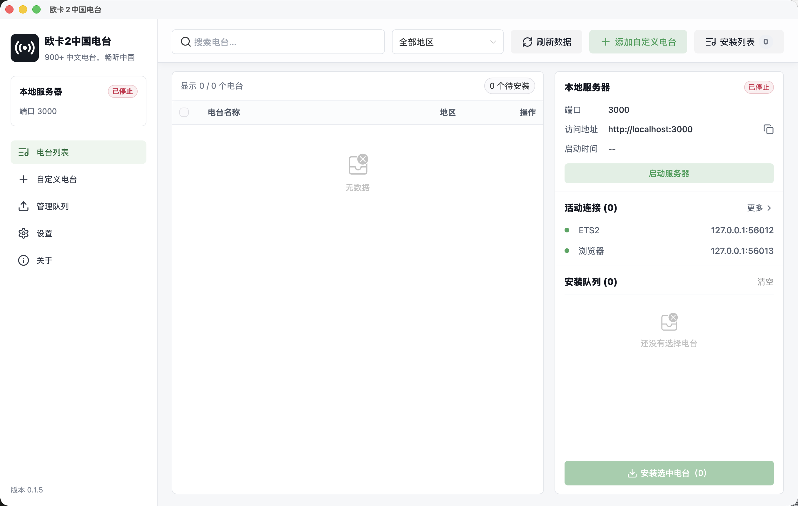
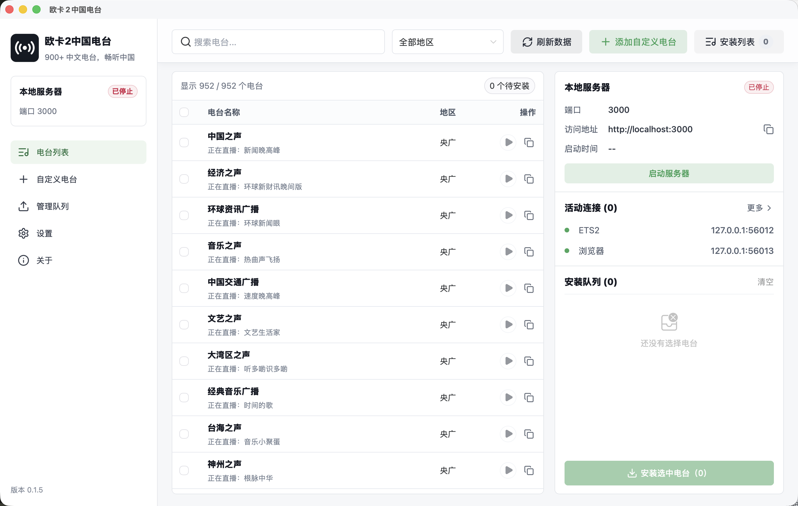
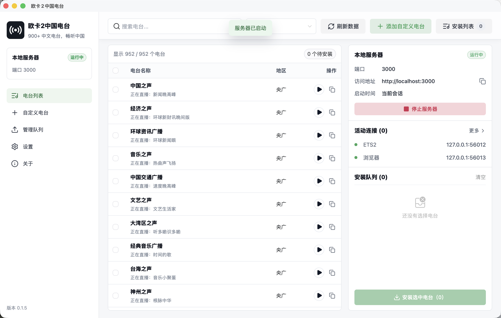
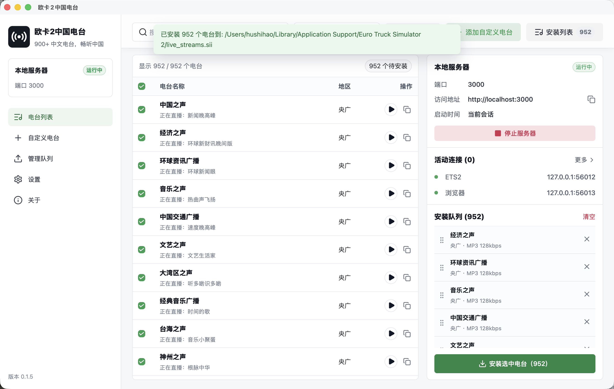

# 欧卡2中国电台 (ETS2 China Radio)

<p align="center">
  <b>让欧洲卡车模拟器 2 也能听到中国电台</b>
</p>

<p align="center">
  <a href="#下载安装">下载安装</a> ·
  <a href="#使用指南">使用指南</a> ·
  <a href="#常见问题">常见问题</a> ·
  <a href="#开发">开发</a>
</p>

---

## 功能特性

- **900+ 中文电台**：自动获取中央台和各省市地方电台。
- **现代桌面界面**：左侧导航、中间 Naive UI 电台表格、右侧本地服务器与安装队列。
- **选择安装**：勾选或全选当前电台，将选中的电台写入欧卡2 `live_streams.sii`。
- **本地流转换**：应用启动本地服务器，将云听电台流转换为游戏可播放的本地地址。
- **内置播放器**：支持安装前试听、上一首/下一首、音量控制和收起播放条。
- **自定义电台**：支持添加 m3u8、mp3 或 FFmpeg 可识别的直播流地址。
- **调试日志**：在设置中打开调试模式后，可通过侧栏日志入口查看运行诊断信息。

## 下载安装

### 系统要求

- **Windows**：Windows 10 / 11 64 位
- **macOS**：macOS 11.0+，Apple Silicon / M 系列芯片
- 已安装 **欧洲卡车模拟器 2 (Euro Truck Simulator 2)**

### 下载

前往 [Releases](https://github.com/hu19940121/ouka2-app/releases) 页面下载最新版本。

**Windows**

- `ETS2-CN-Radio_0.2.0_x64-setup.exe`：NSIS 安装包，带卸载程序

**macOS (Apple Silicon)**

- `ETS2-CN-Radio_0.2.0_aarch64.dmg`：Apple Silicon 安装包

> macOS 首次打开时，如果系统提示应用未经验证，请右键点击应用，选择“打开”，再在弹窗中确认打开。

安装包已内置 FFmpeg，正常使用不需要额外安装运行依赖。

## 使用指南

### 1. 首次启动

首次启动时，电台列表和安装队列都是空的。点击顶部工具栏的 **刷新数据** 获取最新电台。



刷新后的电台数据会缓存到应用数据目录，后续启动时会优先加载本地缓存。

Windows 应用数据目录：

```text
C:\Users\你的用户名\AppData\Roaming\com.ouka2.radio\
```

macOS 应用数据目录：

```text
~/Library/Application Support/com.ouka2.radio/
```

主要缓存文件：

```text
stations.json              # 刷新获取的电台数据
custom_stations.json       # 自定义电台
install_selection.json     # 安装队列选择
```

### 2. 浏览和筛选电台

刷新完成后，中间区域会显示电台表格。可以使用顶部搜索框按名称搜索，也可以通过地区下拉框筛选。



表格左侧复选框用于选择要安装到游戏的电台。表头复选框会选择或取消当前筛选结果。

### 3. 启动本地服务器

在右侧 **本地服务器** 面板点击 **启动服务器**。状态变为“运行中”后，欧卡2 才能通过本地地址播放电台。



默认端口为 `3000`，游戏中实际播放的地址形如：

```text
http://127.0.0.1:3000/stream/电台ID
```

玩游戏时请保持本应用运行，否则游戏里的电台无法继续播放。

### 4. 选择安装队列

勾选电台后，右侧 **安装队列** 会实时显示将写入游戏的电台。你可以在队列中单独移除，也可以点击 **清空** 清除当前选择。

顶部的 **安装列表** 按钮和侧栏 **管理队列** 都可以打开批量管理弹窗，用于更集中地筛选和选择电台。

> 默认安装队列可以为空。只有已勾选或已加入安装队列的电台会写入游戏。

### 5. 安装到欧卡2

确认安装队列无误后，点击右侧底部的 **安装选中电台**。安装成功后，应用会覆盖写入欧卡2的电台配置文件。



Windows 目标文件：

```text
C:\Users\你的用户名\Documents\Euro Truck Simulator 2\live_streams.sii
```

macOS 目标文件：

```text
~/Library/Application Support/Euro Truck Simulator 2/live_streams.sii
```

首次安装或修改电台列表后，建议重启游戏，让欧卡2重新读取 `live_streams.sii`。

### 6. 在游戏内播放

进入欧卡2后，打开电台播放器，在“电台流”列表中可以看到已安装的中文电台。


应用必须保持运行，且本地服务器保持“运行中”，游戏内电台才能正常播放。

### 自定义电台

点击顶部 **添加自定义电台**，填写名称和流地址后保存。自定义电台会出现在普通列表中，也可以通过地区筛选中的“自定义电台”单独查看。

支持的地址类型取决于 FFmpeg，常见的 `m3u8`、`mp3` 直播流都可以尝试。

### 设置与日志

侧栏 **设置** 中可以打开调试模式。调试模式打开后，侧栏会显示 **日志** 菜单，用于查看服务器、播放、FFmpeg 和安装相关诊断信息。

普通使用时不需要开启调试模式；遇到播放失败、端口占用、安装异常时再打开即可。

### 推荐流程

```text
启动应用 → 刷新数据 → 启动服务器 → 勾选安装队列 → 安装到欧卡2 → 重启游戏 → 播放中文电台
```

## 常见问题

### 游戏里看不到电台？

请检查：

1. 安装队列中至少有一个电台。
2. 已点击 **安装选中电台**，并提示写入成功。
3. `live_streams.sii` 位于欧卡2配置目录。
4. 已重启欧卡2，让游戏重新读取电台配置。

### 游戏里有电台但无法播放？

请检查：

1. 应用右侧本地服务器状态是否为“运行中”。
2. 应用内试听是否能正常播放。
3. 本机网络是否可访问电台源。
4. 如仍失败，可在设置中打开调试模式，通过日志查看原因。

### 如何只安装部分电台？

在中间表格勾选需要的电台，或使用搜索/地区筛选后点击表头全选。最终只有右侧安装队列中的电台会写入游戏。

### 能否添加自己的直播流？

可以。点击 **添加自定义电台**，填写名称和流地址即可。自定义电台可以试听，也可以加入安装队列写入游戏。

### 卸载应用后，游戏配置会自动删除吗？

不会。需要手动删除欧卡2目录下的 `live_streams.sii`：

- Windows：`C:\Users\你的用户名\Documents\Euro Truck Simulator 2\live_streams.sii`
- macOS：`~/Library/Application Support/Euro Truck Simulator 2/live_streams.sii`

## 开发

### 前置要求

- Node.js 18+
- Rust 1.70+
- 开发环境中可用的 FFmpeg

### 安装依赖

```bash
npm install
```

### 运行开发版本

```bash
npm run tauri dev
```

### 打包发布

```bash
npm run tauri:build
```

构建流程会同步版本号、准备 FFmpeg、构建 Vue 前端和 Rust/Tauri 后端，并输出安装包。

打包产物目录：

- Windows NSIS：`src-tauri/target/release/bundle/nsis/`
- macOS DMG：`src-tauri/target/release/bundle/dmg/`

### 技术栈

- **前端**：Vue 3 + TypeScript + Pinia + Naive UI
- **桌面端**：Tauri 2
- **后端**：Rust + axum
- **流媒体**：本地 HTTP 服务 + FFmpeg 转码

### 目录结构

```text
ouka2-app/
├── src/                    # Vue 3 前端
│   ├── components/         # 组件
│   ├── stores/             # Pinia 状态
│   └── types/              # TypeScript 类型
├── src-tauri/              # Rust / Tauri 后端
│   ├── src/
│   │   ├── commands/       # Tauri 命令
│   │   ├── radio/          # 电台、SII、流媒体核心逻辑
│   │   └── utils/          # FFmpeg 等工具
│   └── binaries/           # 打包内置二进制资源
├── docImg/                 # README 说明截图
└── scripts/                # 构建辅助脚本
```
